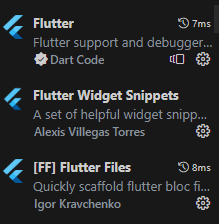
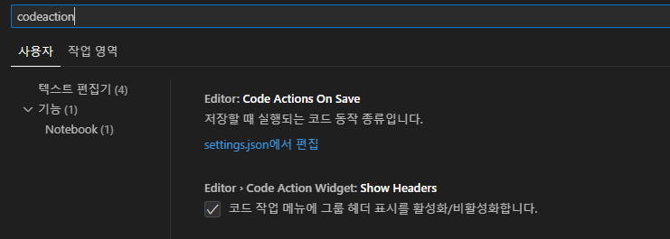
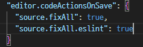
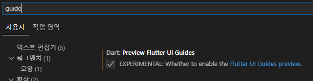

# vsCode flutter 개발 환경

- extention 설치
- 

- 자동완성 세팅 : `설정`에 접속하여 실행(`Ctrl + ,`)
- 
- codeAction On Save 에서 : `setting.json` 편집
- 

- widget tree guide 추가하기
- 설정에서 `guide` 검색하여 `Dart preview flutter UI Guide` 체크표시
- 
